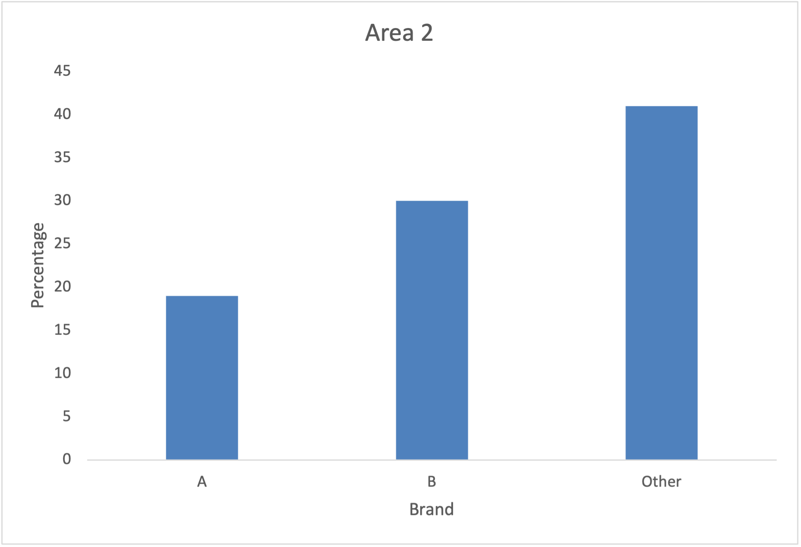
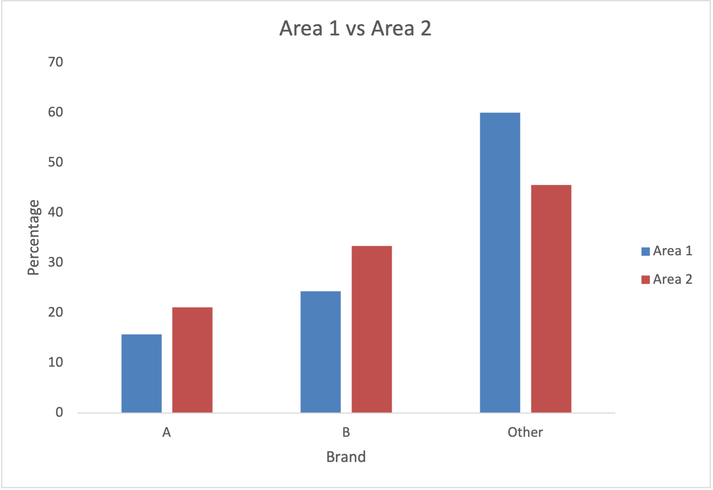
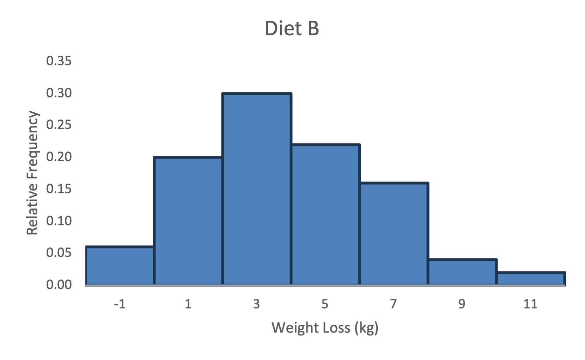

## Unit 9 – Charts Worksheet

### Task 9.1 – Brand Preferences (Area 2)
  
**Interpretation**: Area 2 shows a higher preference for Brands A and B compared to Area 1, with a notable reduction in the "Other" category, suggesting stronger brand alignment in Area 2.

### Task 9.2 – Heather Species Prevalence
  
**Interpretation**: The clustered column chart highlights that Species C is significantly more prevalent in Location 2, while Species A dominates in Location 1, indicating ecological variation.

### Task 9.3 – Diet B Weight Loss (Histogram)
  
**Interpretation**: Diet B shows a more normal distribution, whereas Diet A was slightly right-skewed. Diet B has more moderate outcomes, while Diet A had more outliers with high weight loss.

### Task 9.4 – Relative Frequencies Comparison
  
**Interpretation**: The comparison shows greater variance in outcomes for Diet A, while Diet B has a tighter concentration around the mean.

### Task 9.5 – Cumulative Frequency Comparison
  
**Interpretation**: Diet A reaches cumulative frequencies quicker, indicating faster or more consistent weight loss progress compared to Diet B.

### Task 9.6 – Repeated Histogram (Diet B)
  
**Interpretation**: Reinforces the conclusions from Task 9.3 regarding Diet B's moderate and normally distributed outcomes.
